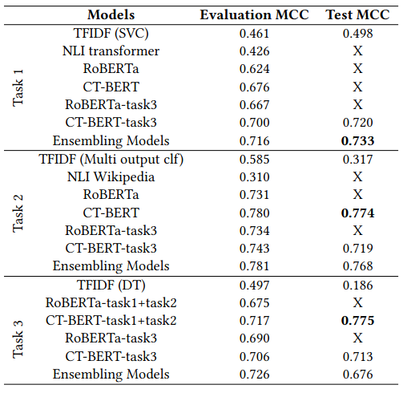

# FakeNews: Corona Virus and Conspiracies Multimedia Analysis Task

This repository contains the D2KLab participation to the [MediaEval 2021 FakeNews Task](https://multimediaeval.github.io/editions/2021/tasks/fakenews/).

We proposed three approaches for which the code implementation are available in [./src/](./src/) for the ones who would like to retrain our models.

An inference notebook is also directly available in [./inference/inference.ipynb](./inference/inference.ipynb). All models are available for download at https://mediaeval-fakenews.tools.eurecom.fr/index.html

The path to the models needs to be specified in the **Input** cell of the inference notebook.

## Citation
```
Youri Peskine, Giulio Alfarano, Ismail Harrando, Paolo Papotti, Raphaël Troncy.
Detecting COVID-19-Related Conspiracy Theories in Tweets.
In Multimedia Benchmark Workshop (MediaEval 2021), 13-15 December 2021, Online.
https://2021.multimediaeval.com/paper65.pdf
```

## Approach

In order to tackle this challenge, we studied three different kind of approaches. The first uses a combination of TFIDF and machine learning algorithms. The second approach uses Natural Language Inference (NLI) combined with metadata from Wikipedia. The third approach aims at fine-tuning transformer-based models.
This last approach was the most performing one and got the best results on all the tasks amongst all the participants.

Our runs are available in [./runs/](./runs/).
 - Run 1 is TFIDF
 - Run 2 is CTBert
 - No run 3
 - Run 4 is task-3-CTBert
 - Run 5 is late fusion ensembling

## Results
The results for our 3 approaches on a validation set and on the test set are summarized on this figure.



## Requirements
```
python==3.8
torch==1.6.0
transformers==3.1.0
pandas==1.3.3
numpy==1.22.3
emoji==0.5.3
notebook
scikit-learn
```
